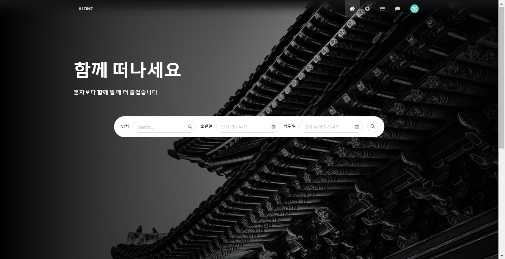
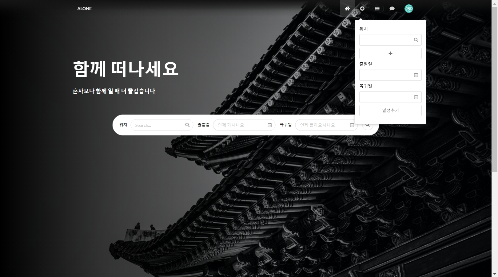
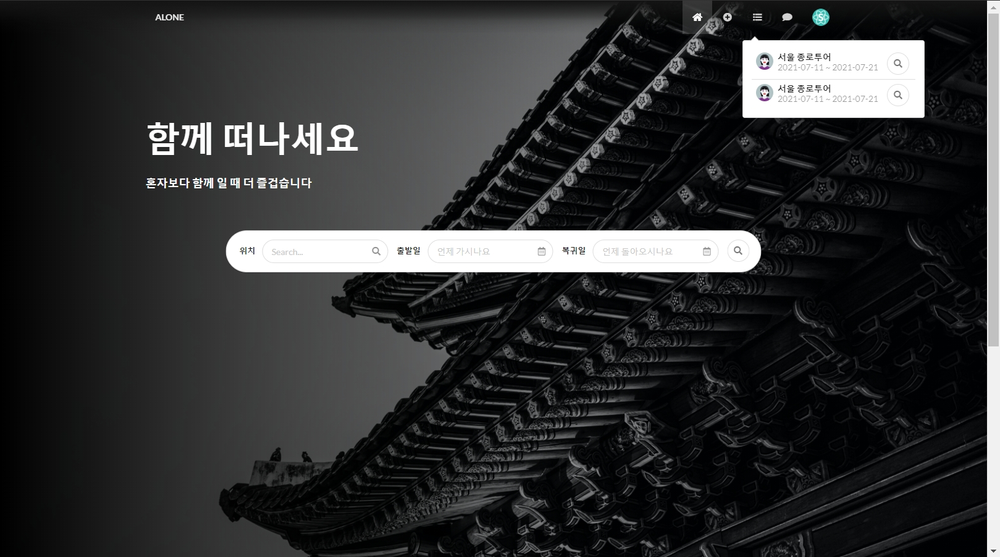
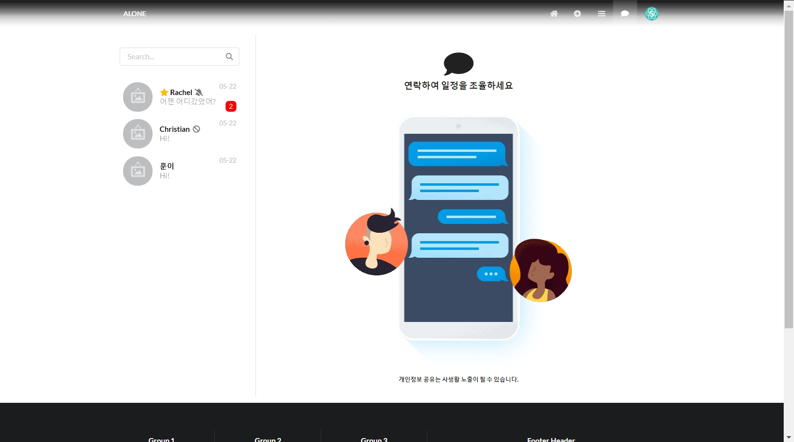
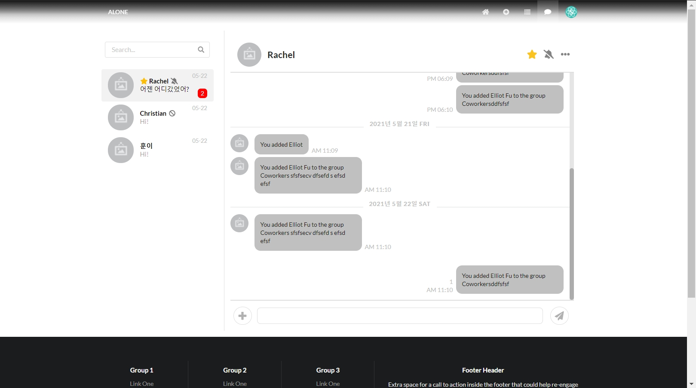
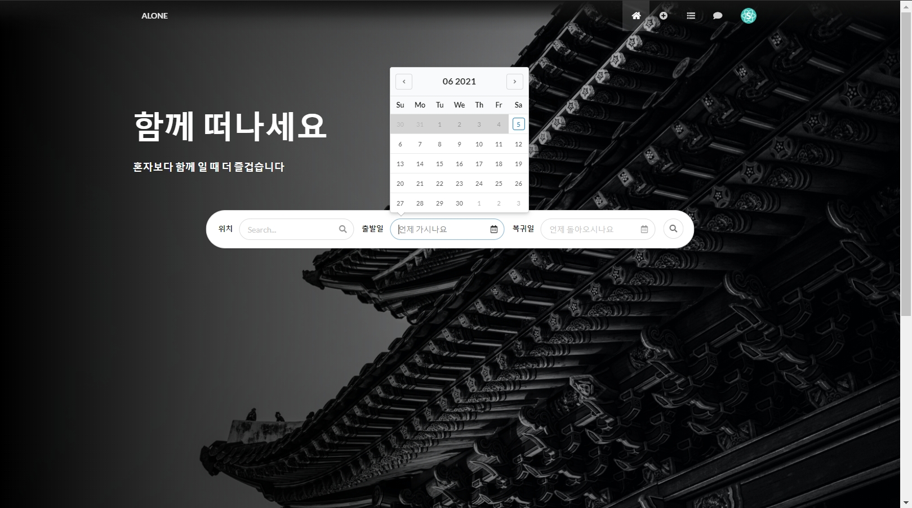
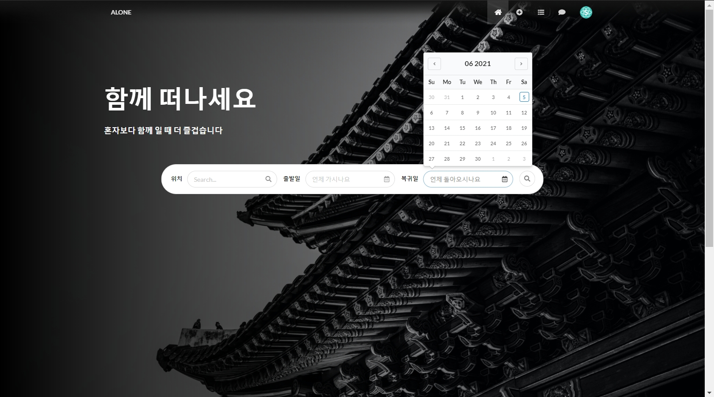

# ALONE PROJECT FRONT

## ALONE 이란? (어떤 서비스인가)

- 새로운 장소에서 새로운 사람들을 쉽게 만나게 도와주는 서비스
- 함께 여행할 사람들을 찾는 서비스

## FRONT 구현 기술

- web framework: express, webpackDevServer(dev)
- js library: React(component), MobX(status)
- Bundler: webpack
- css, component: sematic-ui

## 현재 화면 진행상황

- home 화면
    - home

        

    - home 일정등록

        

    - home 일정확인 및 등록 된 일정으로 조회

        

- chat 화면
    - chat

        

    - chat 메세지 확인

        

- datepicker
    - 이전 날짜 선택 불가

        

    - 이전 날짜 선택 가능

        